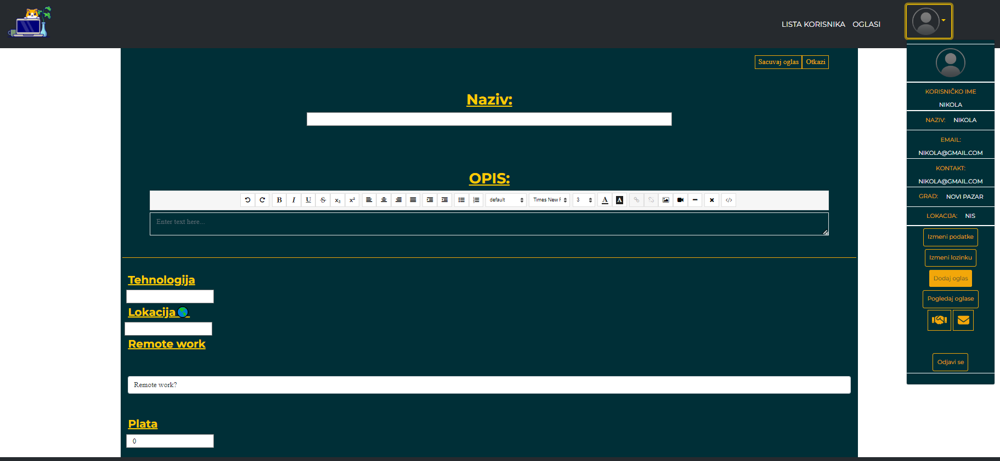

## Početna stranica aplikacije

### Prijavljivanje registrovanog korisnika na sistem

Korisnik se svojim korisničkim imenom i lozinkom prijavljuje na sistem. U zavisnosti od njegovog statusa ima određene privilegije za pristup i rad na sistemu. Odjavljuje se klikom na korisničku sliku pa zatim odabirom opcije **Odjavi se**.

### Menjanje podataka o sebi

Korisnicima koji su registrovani dozvoljeno je menjanje podataka. Korisnik se prijavi na sistem. Klikom na korisničku sliku odabere iz drop menija opciju **Izmeni podatke** kako bi promenio podatke.

### Pregled CV-a

Svi prijavljeni korisnici imaju mogućnost da u listi korisnika pregledaju CV bilo kog radnika. Korisnik se prijavi na sistem. Klikom na **Lista korisnika** otvara se lista svih korisnika. Klikom na profil radnika pojavljuje se opcija **Pogledaj CV** klikom na to dugme otvara se prikaz CV-a korisnika.

## Upravljanje korisnicima

Korisnik koji ima status administratora prijavljuje se na sistem. Klikom na **Listu korisnika** otvara se stranica sa listom svih registrovanih korisnika. Iz liste korisnika admin može da izabere bilo kog korisnika i vidi njegove podatke klikom na odgovarajućeg korisnika. Za svakog izabranog korisnika pojavljuje se opcija za njegovo brisanje.

## Dodavanje oglasa

Korisnicima koji su registrovani kao Privatna lica/Firma dozvoljeno je dodavanje oglasa. Korisnik se prijavi na sistem. Klikom na korisničku sliku odabere iz drop menija opciju **Dodaj oglas**. Korisniku je dozvoljeno maksimalno 5 oglasa.

## Slanje zahteva od strane Radnika

Korisnicima koji su registrovani kao Radnik dozvoljeno je slanje zahteva za određeni oglas. Korisnik se prijavi na sistem. Klikom na **Oglasi** otvara se stranica sa oglasima. Odabirom željenog oglasa pojavljuju se dodatne informacije o oglasu kao i dugme **Apliciraj**.

## Slanje zahteva od strane Privatnog lica/Firme

Korisnicima koji su registrovani kao Privatno lice/Firma dozvoljeno je slanje zahteva Radnicima za oglase koje su isti ti poslodavci objavili. Korisnik se prijavi na sistem. Klikom na **Listu korisnika** otvara se stranica sa listom korisnika. Odabirom radnika pojavljuje se dugme **Pošalji zahtev**. Otvara se modal za izbor oglasa za koji poslodavac želi da pošalje zahtev.

## Filtriranje korisnika

Svi korisnici mogu da vide listu registrovanih korisnika. Korisnik se prijavi na sistem. Klikom na **Lista korisnika** otvara se lista svih korisnika. Lista se može filtrirati pomoću inputa koji se nalazi iznad tabele. Unosom podataka lista se automatski filtrira.

## Filtriranje oglasa

Svi korisnici mogu da vide listu oglasa. Korisnik se prijavi na sistem. Klikom na **Oglasi** otvara se lista oglasa. Lista se može filtrirati pomoću inputa koji se nalazi iznad tabele. Unosom podataka lista se automatski filtrira.

